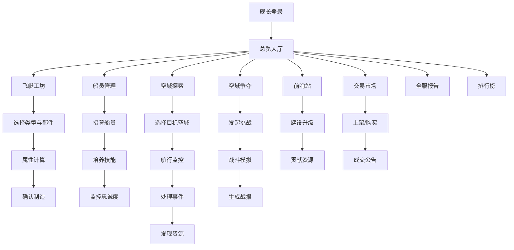

## 1. 产品概述
多人在线魔法飞艇竞速与空域争夺系统——一个奇幻蒸汽朋克风格的策略经营与实时对抗平台。玩家制造个性化魔法飞艇、招募船员、探索未知空域、争夺领地控制权、建立前哨站、参与全球贸易，在全服排行榜上角逐最强舰队之名。

- 目标用户：喜爱策略经营与PvP对抗的硬核玩家群体
- 市场价值：融合飞艇定制、空域探索、公会对抗和贸易经济的复合玩法，提供深度的策略体验与社交互动

## 2. 核心功能

### 2.1 用户角色
| 角色 | 注册方式 | 核心权限 |
|------|----------|----------|
| 舰长 | 游戏账号注册 | 制造飞艇、招募船员、探索空域、发起争夺战、建立前哨站、参与交易 |
| 公会会长 | 舰长晋升 | 管理公会成员、分配前哨站资源、制定公会战略 |
| 公会成员 | 加入公会 | 参与公会任务、贡献前哨站升级资源 |

### 2.2 功能模块
1. **总览大厅**：玩家资产总览、今日事件、快捷入口、全服公告滚动
2. **飞艇工坊**：飞艇制造与改装、部件选择搭配、属性实时计算
3. **船员管理**：船员招募、技能培养、忠诚度监控
4. **空域探索**：空域地图、实时航行状态、随机事件处理
5. **空域争夺**：争夺战发起与匹配、战斗模拟、战报查看
6. **前哨站**：前哨站建设与升级、资源采集、公会管理
7. **交易市场**：飞艇图纸与稀有部件交易、定价与成交系统
8. **全服报告**：势力热力图、出勤曲线、贸易收益图、PDF导出
9. **排行榜**：战力排名、空域积分、公会财富排名、他人配置查看

### 2.3 页面详情
| 页面名称 | 模块名称 | 功能描述 |
|----------|----------|----------|
| 总览大厅 | 资产概览 | 显示玩家飞艇数量、金币、资源、船员总数 |
| 总览大厅 | 今日事件 | 随机生成的当日天气与暴风季警告 |
| 总览大厅 | 快捷入口 | 飞艇工坊、空域探索、争夺战等快速跳转 |
| 总览大厅 | 全服公告 | 交易成交、争夺战结果、暴风季事件滚动播报 |
| 飞艇工坊 | 飞艇列表 | 展示玩家拥有的所有飞艇及状态 |
| 飞艇工坊 | 制造面板 | 选择龙骨、引擎、帆布、特殊装置，实时计算属性 |
| 飞艇工坊 | 属性雷达图 | 展示极速、机动性、防御力、载重、航程的五维雷达图 |
| 飞艇工坊 | 类型选择 | 探险型/战斗型/货运型，影响空域探索效率加成 |
| 船员管理 | 船员列表 | 展示所有船员的职业、技能、忠诚度状态 |
| 船员管理 | 招募面板 | 随机刷新可招募的领航员、技师、炮手 |
| 船员管理 | 忠诚度警告 | 忠诚度过低时红色警告，提示叛变风险 |
| 空域探索 | 空域地图 | 六角格地图，显示已探索/未探索区域 |
| 空域探索 | 航行状态 | 实时高度、氧气、部件耐久度仪表盘 |
| 空域探索 | 事件面板 | 随机事件弹窗：风暴、乱流、野生巨鹰 |
| 空域探索 | 发现面板 | 发现浮空岛和资源点的详细信息 |
| 空域争夺 | 发起挑战 | 选择目标空域，查看攻防优势预估 |
| 空域争夺 | 战斗模拟 | 实时显示帆布破损、引擎动力、船员伤亡 |
| 空域争夺 | 战报详情 | 个人杀敌数、资源掠夺量、双方损失统计 |
| 前哨站 | 前哨站列表 | 公会占领的所有前哨站及等级 |
| 前哨站 | 升级面板 | 贡献资源和金币，查看升级进度和收益加成 |
| 前哨站 | 收益统计 | 巡航范围加成、采集收益加成数据 |
| 交易市场 | 商品列表 | 飞艇图纸和稀有部件列表，含近7天均价参考 |
| 交易市场 | 上架面板 | 卖家定价，系统自动建议价格区间 |
| 交易市场 | 成交公告 | 全服公告展示，暴风季事件触发 |
| 全服报告 | 势力热力图 | 空域控制势力分布可视化 |
| 全服报告 | 出勤曲线 | 每日飞艇出勤数量折线图 |
| 全服报告 | 贸易路线图 | 贸易路线与收益可视化 |
| 全服报告 | PDF导出 | 含飞艇战力雷达图和航线趋势图的报告导出 |
| 排行榜 | 战力排行 | 按飞艇综合战力排名 |
| 排行榜 | 空域积分 | 按空域控制积分排名 |
| 排行榜 | 公会财富 | 按公会总财富排名 |
| 排行榜 | 配置查看 | 查看他人飞艇配置和前哨站布局 |

## 3. 核心流程

**飞艇制造流程**：舰长进入飞艇工坊 → 选择飞艇类型（探险/战斗/货运） → 依次选择龙骨、引擎、帆布 → 选择特殊装置（护盾/隐形等） → 系统实时计算极速、机动性、防御力 → 确认制造 → 扣除资源 → 飞艇入列

**空域探索流程**：舰长选择飞艇与船员编队 → 进入空域地图选择目标区域 → 开始探索 → 实时监控高度/氧气/耐久 → 触发随机事件（风暴/乱流/巨鹰） → 处理事件 → 发现浮空岛/资源点 → 探索结果结算

**空域争夺流程**：舰长选择目标空域 → 系统计算攻防优势（飞艇战力+空域控制度+天气） → 发起争夺战 → 实时战斗模拟（帆布破损/引擎动力/船员伤亡） → 战斗结束 → 生成战报（杀敌数/资源掠夺量） → 空域归属变更

**交易流程**：卖家选择图纸/部件 → 系统按近7天均价建议价格区间 → 卖家定价上架 → 买家浏览购买 → 成交全服公告 → 触发暴风季事件

## 4. 用户界面设计

### 4.1 设计风格
- 主色调：深邃藏蓝（#0B1D3A）+ 琥珀金（#D4A843）+ 铜绿（#2A9D8F）
- 辅助色：暗红（#C0392B）用于警告与战斗，银白（#E8E8E8）用于文字与边框
- 按钮风格：金属质感圆角按钮，带微光边缘和悬停发光效果
- 字体：标题使用 Cinzel（古典衬线），正文使用 Noto Sans SC
- 布局风格：左侧导航栏 + 主内容区的仪表盘布局，蒸汽朋克齿轮与管道装饰元素
- 图标风格：蒸汽朋克线条图标，齿轮、飞艇、罗盘、望远镜等主题

### 4.2 页面设计概览
| 页面名称 | 模块名称 | UI元素 |
|----------|----------|--------|
| 总览大厅 | 资产概览 | 卡片式布局，金属边框，数据高亮显示 |
| 总览大厅 | 今日事件 | 横幅通知条，天气图标动画 |
| 总览大厅 | 全服公告 | 底部滚动字幕，半透明背景 |
| 飞艇工坊 | 制造面板 | 左侧部件选择列表，右侧实时属性雷达图 |
| 飞艇工坊 | 类型选择 | 三选一卡片，选中时发光边框 |
| 船员管理 | 船员列表 | 人物卡片，职业图标，忠诚度进度条 |
| 空域探索 | 空域地图 | 六角格地图，已探索区域渐变着色，未探索迷雾覆盖 |
| 空域探索 | 航行状态 | 圆形仪表盘，指针式高度计，进度条式氧气和耐久 |
| 空域争夺 | 战斗模拟 | 分屏显示双方状态，实时动画更新损伤 |
| 全服报告 | 热力图 | 空域势力色彩渐变图，悬浮显示势力信息 |
| 排行榜 | 排名列表 | 前三名金银铜特殊样式，展开查看详情 |

### 4.3 响应式设计
- 桌面优先设计，适配1920×1080为主
- 平板端（768px+）调整侧边栏为可折叠
- 移动端（<768px）切换为底部Tab导航，简化仪表盘布局

### 4.4 3D场景指引
- 空域探索地图使用2.5D等距视角，浮空岛带投影和悬浮动画
- 战斗模拟使用简化3D侧视图，飞艇模型左右对峙
- 环境氛围：浮云粒子效果，天空渐变背景
