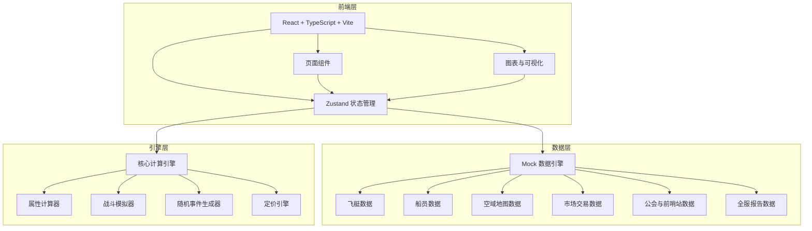
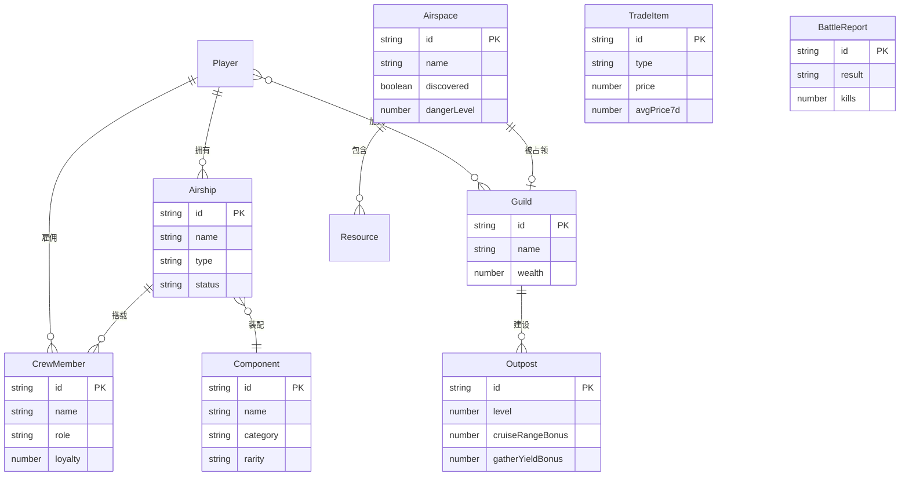

## 1. 架构设计



## 2. 技术说明
- 前端：React@18 + TypeScript + Vite + Tailwind CSS@3
- 初始化工具：vite-init
- 后端：无（前端纯静态演示，所有数据使用Mock引擎模拟）
- 数据库：无（使用内存中的Mock数据，zustand持久化至localStorage）
- 图表：Recharts（热力图、折线图、雷达图）
- PDF导出：jsPDF + html2canvas
- 状态管理：Zustand

## 3. 路由定义
| 路由 | 用途 |
|------|------|
| / | 总览大厅，玩家资产概览与快捷入口 |
| /workshop | 飞艇工坊，飞艇制造与改装 |
| /crew | 船员管理，招募与忠诚度监控 |
| /explore | 空域探索，地图与航行 |
| /battle | 空域争夺，发起挑战与战报 |
| /outpost | 前哨站，建设升级与公会管理 |
| /market | 交易市场，图纸部件买卖 |
| /report | 全服报告，热力图与数据导出 |
| /leaderboard | 排行榜，全服排名 |

## 4. API定义
无后端API，所有数据通过Mock引擎在客户端生成。

核心数据接口（TypeScript类型）：

```typescript
interface Airship {
  id: string
  name: string
  type: "exploration" | "combat" | "cargo"
  keel: Component
  engine: Component
  sail: Component
  specialDevice: Component | null
  stats: AirshipStats
  crew: CrewMember[]
  status: "docked" | "exploring" | "battle" | "repairing"
}

interface AirshipStats {
  maxSpeed: number
  maneuverability: number
  defense: number
  capacity: number
  range: number
}

interface Component {
  id: string
  name: string
  category: "keel" | "engine" | "sail" | "special"
  rarity: "common" | "rare" | "epic" | "legendary"
  stats: Partial<AirshipStats>
  specialEffect?: string
}

interface CrewMember {
  id: string
  name: string
  role: "navigator" | "technician" | "gunner"
  skills: Skill[]
  loyalty: number
  salary: number
}

interface Skill {
  name: string
  level: number
  effect: string
}

interface Airspace {
  id: string
  name: string
  hexCoords: [number, number]
  owner: string | null
  resources: Resource[]
  discovered: boolean
  dangerLevel: number
  weather: Weather
}

interface BattleReport {
  id: string
  attacker: string
  defender: string
  airspaceId: string
  result: "victory" | "defeat"
  kills: number
  loot: Resource[]
  damageReport: DamageReport
  timestamp: number
}

interface DamageReport {
  sailIntegrity: number
  enginePower: number
  crewCasualties: number
}

interface Outpost {
  id: string
  name: string
  airspaceId: string
  level: number
  contribution: Record<string, number>
  bonuses: OutpostBonuses
}

interface OutpostBonuses {
  cruiseRange: number
  gatherYield: number
}

interface TradeItem {
  id: string
  name: string
  type: "blueprint" | "component"
  seller: string
  price: number
  suggestedMin: number
  suggestedMax: number
  avgPrice7d: number
  listedAt: number
}

interface WeeklyReport {
  weekNumber: number
  territoryHeatmap: Record<string, string>
  attendanceCurve: Array<{ date: string; count: number }>
  tradeRevenue: Array<{ route: string; revenue: number }>
  topEvents: string[]
}
```

## 5. 服务器架构图
无后端服务器，纯前端架构。

## 6. 数据模型

### 6.1 数据模型定义



### 6.2 数据定义语言
使用 localStorage 持久化，初始数据由 Mock 引擎生成。

初始飞艇部件数据示例：
- 龙骨：铁木龙骨（普通）、秘银龙骨（稀有）、龙骨·风暴之心（传说）
- 引擎：蒸汽核心（普通）、魔力涡轮（稀有）、引擎·永恒之火（传说）
- 帆布：棉麻帆（普通）、风灵丝绸（稀有）、帆布·苍穹之翼（传说）
- 特殊装置：护盾发生器、隐形斗篷、风暴召唤器、修复蜂群
